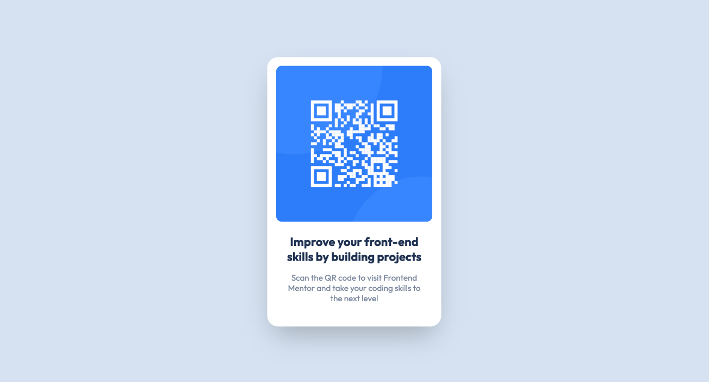

# Frontend Mentor - QR code component solution

This is a solution to the [QR code component challenge on Frontend Mentor](https://www.frontendmentor.io/challenges/qr-code-component-iux_sIO_H).

## Table of contents

- [Overview](#overview)
  - [Screenshot](#screenshot)
  - [Links](#links)
- [My process](#my-process)
  - [Built with](#built-with)
  - [What I learned](#what-i-learned)
- [Author](#author)

## Overview

### Screenshot

### Links

- Solution URL: [https://github.com/frontendstu/qr-code-component](https://github.com/frontendstu/qr-code-component)
- Live Site URL: [https://frontendstu.github.io/qr-code-component/](https://frontendstu.github.io/qr-code-component/)

## My process

### Built with

- Semantic HTML5 markup
- CSS custom properties
- CSS Grid
- Mobile-first workflow

### What I learned

While I already have a strong understanding of semantic HTML markup and CSS, this project was a breeze.

## Author

- Website - [https://github.com/frontendstu](https://github.com/frontendstu)
- Frontend Mentor - [@frontendstu](https://www.frontendmentor.io/profile/frontendstu)
- Twitter - [@deathb4decaf88](https://twitter.com/deathb4decaf88)
